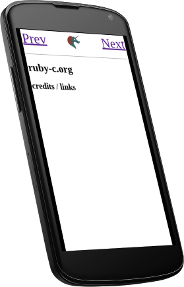

# org-present-remote

org-present-remote adds a simple, mobile-friendly web remote control for moving between slides in [org-present](https://github.com/rlister/org-present).



## usage

To start it, first enter presentation mode with `M-x org-present`, then do `M-x org-present-remote--remote-on`.

You will need to enter the host to which to make the interface available on.  For local testing this can be `localhost`.  For actual use you will need to supply your machine's IP address.

Then use a browser to open the remote control by browsing to port 8009 on the host you supplied, e.g.:

[http://localhost:8009/](http://localhost:8009)

## faq
### how do I determine my IP address?
On many *NIX systems you can do this with ifconfig.  For example, to determine the IP address of your WiFi adaptor on FreeBSD:

```
$ ifconfig wlan0
wlan0: flags=8843<UP,BROADCAST,RUNNING,SIMPLEX,MULTICAST> metric 0 mtu 1500
  ether 24:77:03:29:94:cc
  hwaddr 24:77:03:29:94:cc
  inet 192.168.43.81 netmask 0xffffff00 broadcast 192.168.43.255
  nd6 options=29<PERFORMNUD,IFDISABLED,AUTO_LINKLOCAL>
  media: IEEE 802.11 Wireless Ethernet MCS mode 11ng
  status: associated
  ssid DuncansS4 channel 1 (2412 MHz 11g ht/20) bssid ec:9b:f3:af:3d:25
  regdomain APAC2 country AU authmode WPA2/802.11i privacy ON
  deftxkey UNDEF AES-CCM 2:128-bit AES-CCM 3:128-bit txpower 30 bmiss 10
  scanvalid 60 protmode CTS ampdulimit 64k ampdudensity 4
  -amsdutx amsdurx shortgi -stbc wme roaming MANUAL
  groups: wlan
```

From this you can see that your IP address is 192.168.43.81.

## license
org-present-remote is licensed under the GNU General Public License v3.
